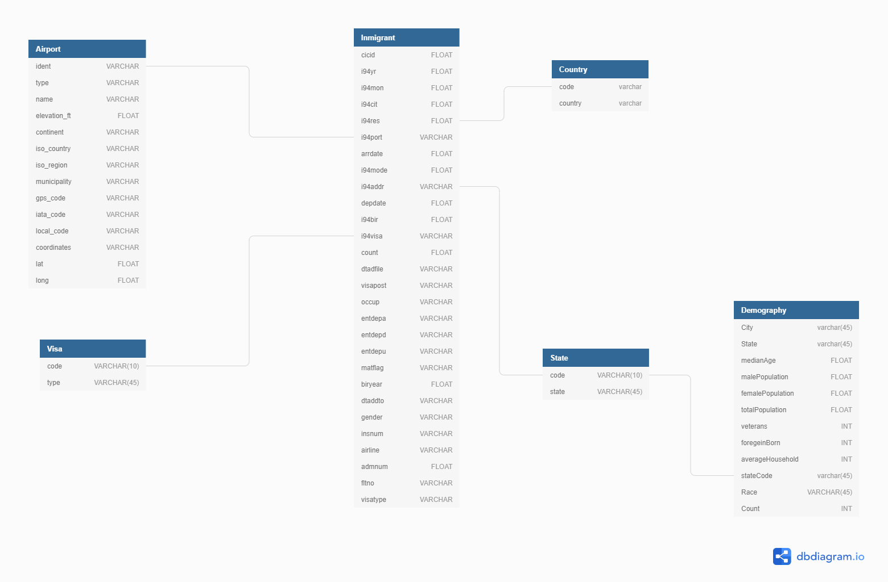
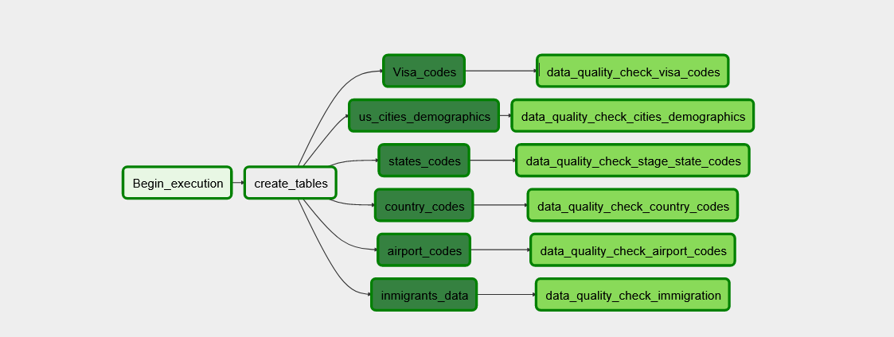

# Capstone Project

### Context:

The main purpose of this project is to create an analytical database from the US National Tourism and Trade Office data, including the world temperature data and the U.S city demography. This will help the data scientist team to derive knowlegde from this dataset. In order to acheive this, it will be used amazon S3 to store files, Airflow to create the ETL pipeline and Redshift to store the data and allow to perform analytical queries.

Refer to the jupyter notebook to check a detailed data dictionary 

### Data:

- I94 Immigration Data: This data comes from the US National Tourism and Trade Office. 
- World Temperature Data:
- U.S. City Demographic Data:
- Airport Code Table: This is a simple table of airport codes and corresponding cities. 

### Schema
In the Labels description file were various tables that enrich the inmigrants fact table. The follow schema show the fact table and dimensional tables.

### ETL
To create the ETL pipeline it was used Airflow, that gives a UI to see the dependecies between the steps involved. After populating the tables.

### How to run

To run the pipeline `/dags`, `/plugings` and `create_tables.sql` should be added to an environment with airflow, then start the airflow webserver, add the AWS and refshift crendtials and the run the DAG called `etl.py`. This will crate the tables and populate it.

The `dl.cfg` should be populated with the redshift credentials, to run the notebook.