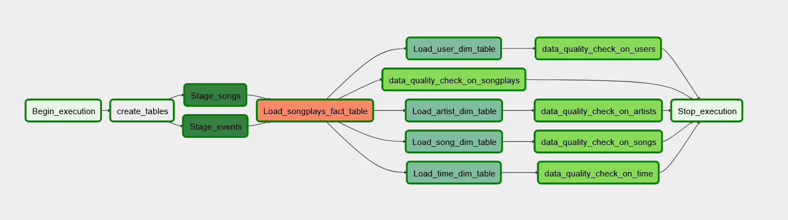

# Data Pipelines with airflow

### Context:

A music streaming company, Sparkify, has decided that it is time to introduce more automation and monitoring to their data warehouse ETL pipelines and come to the conclusion that the best tool to achieve this is Apache Airflow.

They have decided to bring you into the project and expect you to create high grade data pipelines that are dynamic and built from reusable tasks, can be monitored, and allow easy backfills. They have also noted that the data quality plays a big part when analyses are executed on top the data warehouse and want to run tests against their datasets after the ETL steps have been executed to catch any discrepancies in the datasets.

The source data resides in S3 and needs to be processed in Sparkify's data warehouse in Amazon Redshift. The source datasets consist of JSON logs that tell about user activity in the application and JSON metadata about the songs the users listen to.

### Data Base Schema:

There are 5 tables in the data base and the schema used was "Star Schema". One main table wich stores events performed by users and 4 dimentional tables that store information related to logs (users, artists, time, songs).
The reason behind this schema, is that it gives flexibility to perform complex queries and answer business questions.

### Operators:

There were created 4 Operators to transform the data and load in the fact and dimensional tables and perform a data quality on it. For creating the tables it was used a built in operator of airflow.

StageToRedshiftOperator: Copies JSON data from S3 to staging tables in redsift, this is done with a SQL copy statment.

LoadDimensionOperator: Loads a dimension table from data in the staging tables.

LoadFactOperator: Load fact tables from data in staging tables.

DataQualityOperator: Runs to check the data that was loaded. This is done with a SQL query, the quaility check fails if the results does not match.

### How To Run the Project

1. Create an enviroment with Airflow

2. Star running airflow service

3. In the connections section (under admin) add the connections for redshift and AWS:

4. Start the DAG

### DAG Schema

### Project Structure

ROOT folder:

* `create_tables.sql` SQL Table creations statements

DAGS folder:
* `udac_example_dag.py` contains the DAG definition with tasks and dependencies

Plugings/Helpers folder:
* `sql_queries.py`  Insert SQL statements

Plugings/Operators folder:
* `data_quality.py` contains Data Quality Operator wich validates data quality in redshift tables
* `load_dimension.py` contains Load Dimension Operator which loads a dimension table from staging table.
* `load_fact.py` contains Load Fact Operator which loads a fact table from staging table.
* `stage_redshift.py` contains Stage For Redshift Operator that copies data from S3 buckets into redshift staging tables

